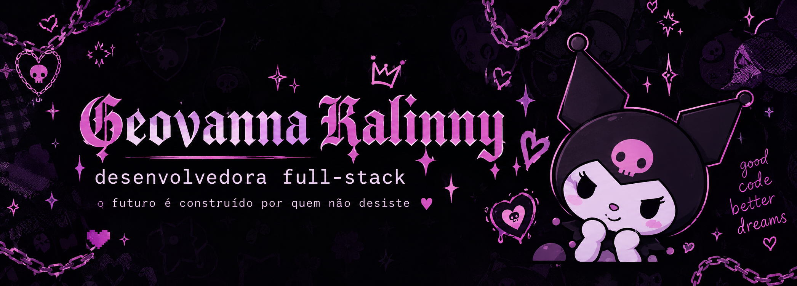

  

  

  

---

# ♡ SOBRE MIM

<table>
<tr>

<td width="60%" valign="top">

Olá! Eu sou **Geovanna Kalinny**.

Sou uma **desenvolvedora Full-Stack em formação**, apaixonada por tecnologia, criatividade e desenvolvimento de projetos.

Gosto de trabalhar tanto com **Front-end** quanto com **Back-end**, conectando interfaces, lógica de aplicação, bancos de dados e APIs.

Também tenho interesse em **Game Development**, criação de universos, design e projetos que tenham uma identidade própria.

 

> ✦ **sonhe. planeje. conquiste.**

</td>

<td width="40%" align="center">

